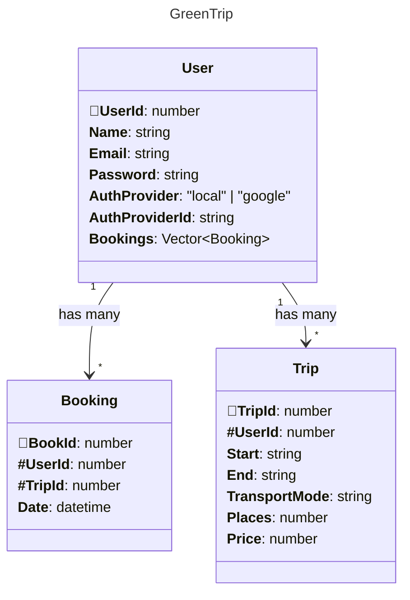

# 🚀 TP-GreenTrip

## 🧩 Backend

### 📦 Modèles de données

#### 👤 `User`

| Champ            | Type        | Description                         |
| ---------------- | ----------- | ----------------------------------- | -------------------------- |
| `UserId`         | `number`    | Identifiant unique de l'utilisateur |
| `Name`           | `string`    | Nom complet                         |
| `Email`          | `string`    | Adresse email                       |
| `Password`       | `string`    | Mot de passe (à hasher)             |
| `AuthProvider`   | `local      | google`                             | Méthode d'authentification |
| `AuthProviderId` | `string`    | ID du fournisseur externe           |
| `Bookings`       | `[Booking]` | Réservations associées              |

---

#### 🚗 `Trip`

| Champ           | Type     | Description                     |
| --------------- | -------- | ------------------------------- |
| `TripId`        | `number` | Identifiant unique du trajet    |
| `UserId`        | `number` | Créateur du trajet (conducteur) |
| `Start`         | `string` | Ville de départ                 |
| `End`           | `string` | Ville d’arrivée                 |
| `TransportMode` | `string` | Mode de transport               |
| `Places`        | `number` | Nombre de places disponibles    |
| `Price`         | `number` | Prix par place                  |

---

#### 📦 `Booking`

| Champ    | Type       | Description                          |
| -------- | ---------- | ------------------------------------ |
| `BookId` | `number`   | Identifiant unique de la réservation |
| `UserId` | `number`   | Utilisateur qui réserve              |
| `TripId` | `number`   | Trajet réservé                       |
| `Date`   | `datetime` | Date de la réservation               |

#### 📊 `Version diagramme`



---

### ⚙️ Fonctions disponibles

#### 🔐 `createAccount`

```js
createAccount(name, email, password, AuthProvider, AuthProviderId);
```

- Paramètres :

  - name: `string`
  - email: `string`
  - password: `string`
  - AuthProvider: `"local" | "google"`
  - AuthProviderId: `string`

- Retourne:
  ```js
  {
  success: boolean,
  message?: string,
  user: User
  }
  ```

#### 🔓`login`

```js
login(email, password);
```

- Paramètres:

  - email: `string`
  - password: `string`

- Retourne:
  ```js
  {
  success: boolean,
  message: string,
  user?: User
  }
  ```

#### 🗑️`deleteAccount`

```js
deleteAccount(email);
```

- Paramètres:

  - email: `string`

- Retour
  ```js
  {
  success: boolean,
  message: string
  }
  ```
